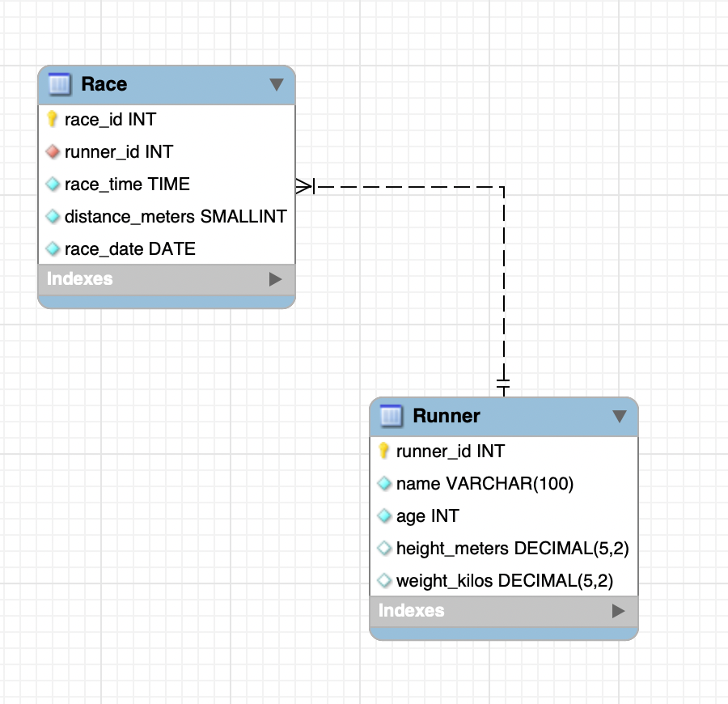
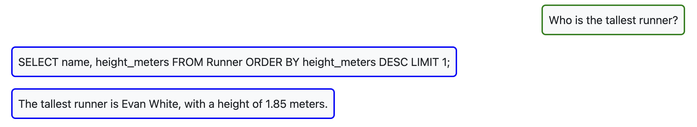
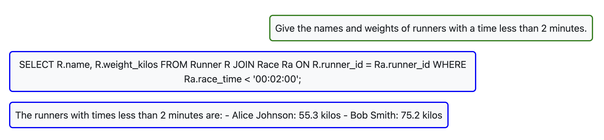
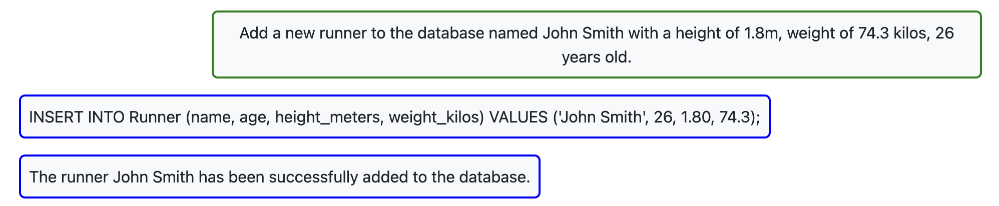
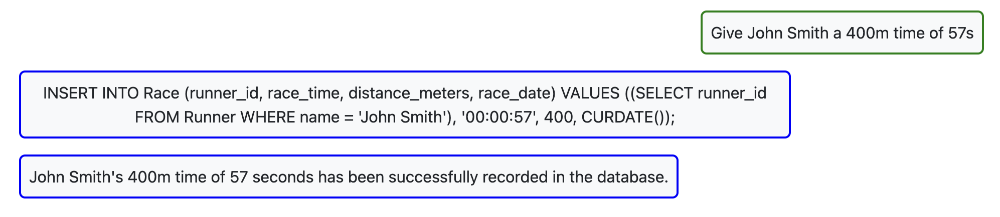
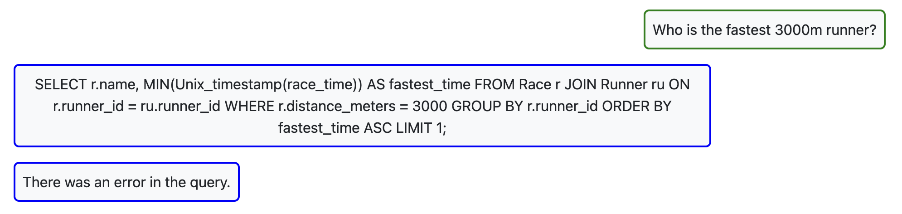

# Runner

My database contains information about runners and the races they have competed in.

## Prompting strategies

The example images below of queries and responses demonstrate a zero-shot approach, where the LLM was not provided with a demonstration example. The LLM was, however, provided with the `CREATE TABLE` statements, allowing it to know the database structure and data types. 
I also tried a single shot approach, providing the LLM with an example query and response, but it did not lead to any performance improvements. ChatGPT-4o-mini is excellent at converting natural language to SQL.

## Successful Queries

## Unsuccessful query

I changed the wording of the question, and there was no error with the query.

