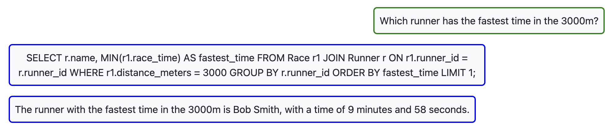

# Runner

My database contains information about runners and the races they have competed in.

## Successful Queries

## Unsuccessful query

I changed the wording of the question, and there was no error with the query.

